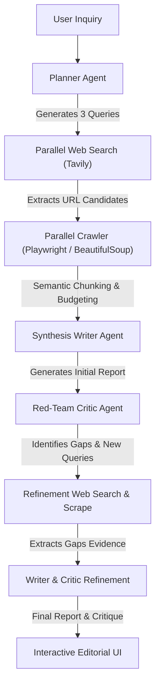

# Renaissance: Self-Skeptical AI Research Assistant

Renaissance is an evidence-driven, cognitive investigation suite designed to query the live web, ingest and filter source materials under strict token budgets, synthesize findings, and subject them to rigorous adversarial audit (red-teaming) before refining conclusions.

Unlike standard AI search systems that generate answers instantaneously and suffer from confirmation bias, Renaissance actively seeks to disprove its own hypotheses, grading its confidence levels and separating verified facts from interpretations and unknowns.

---

## Intent & Philosophy

The project is built on a simple, powerful philosophy: **"Doubt is the origin of wisdom."** 

When answering complex inquiries, typical LLM pipelines immediately choose a narrative and select web search results to support it. Renaissance disrupts this bias through a self-skeptical research loop:
1. **Doubt Everything First:** It assumes the initial thesis might be wrong or incomplete.
2. **Adversarial Audit:** An independent red-team agent reviews the draft report specifically looking for selective evidence use, weak reasoning, or logical leaps.
3. **Provisional Findings:** All reports are structured to clarify what is strictly verified by evidence, what is reasonably assumed, and what remains unknown. Conclusions are kept provisional, identifying exactly what new data would change the final verdict.

---

## Core Capabilities

- **Adversarial Writer-Critic Architecture:** Features a dual-agent workflow where an independent Critic agent audits the initial findings, identifies logical gaps, and triggers a secondary refinement search.
- **Multidimensional Search Vectoring:** The Planner agent structures searches into confirmatory, contrarian (falsification), and mechanistic angles to ensure objective data collection.
- **Context-Aware Page Chunking:** The web crawler splits scraped pages and ranks text chunks by term-frequency similarity against the user query, keeping the final consolidated payload under a ~15,000-character budget.
- **Dynamic Crawler with Fallbacks:** Integrates headless browser automation via Playwright for dynamically-rendered sites, falling back to static HTTP requests, and search snippet aggregation if crawling fails.
- **Multi-LLM Integration:** Supports Groq (Llama), Gemini, OpenAI, and Mistral models with automated API fallback chains.
- **Web Interface:** Features a real-time log terminal, structured report views, red-team critiques, and source attribution.

---

## System Architecture & Workflow



### The 6-Step Pipeline:
1. **Planning:** The user request is parsed into confirmatory, contrarian, and mechanistic sub-queries.
2. **Parallel Searches:** Dispatches all search queries simultaneously to find relevant pages.
3. **Parallel Scraping:** Crawls the discovered links concurrently. The scraped content is split, scored for keyword density against the user inquiry, and sorted to fit the context budget.
4. **Initial Report:** Compiles a provisional report detailing supporting and contradicting evidence, causal mechanisms, uncertainties, and a calibrated confidence level.
5. **Red Team Critique:** The Critic agent audits the draft, checks for bias, and produces 1-2 new targeted queries to resolve remaining gaps.
6. **Refinement:** The system conducts a second research phase targeting the critic's questions and updates the final report and critique.

---

## Directory Structure

```text
├── agents.py           # Configuration for LLM clients and execution chains
├── prompts.py          # Detailed system templates for Planner, Writer, and Critic agents
├── tools.py            # Custom tool decorators (web search, Playwright/BeautifulSoup crawler)
├── workflow.py         # Main execution orchestration of the parallel search/scrape/refine process
├── main.py             # Console-based command line interface (CLI) client
├── server.py           # FastAPI backend server with Server-Sent Events (SSE) log streaming
├── requirements.txt    # Python backend package dependencies
├── prompt.md           # Master prompt guidelines and stop conditions
├── simplifed_prompt.md # Simplified/minimal agent ruleset reference
└── frontend/           # Next.js SPA frontend web application
    ├── src/app/        # Core page layouts, global styling, and Home component
    ├── package.json    # Frontend script commands and dependencies
    └── README.md       # Default Next.js boilerplate documentation
```

---

## Getting Started

### 1. Prerequisites
- **Python 3.10+**
- **Node.js 18+ & npm** (for the web client)
- API Keys: Set up a `.env` file in the root directory containing the following:
  ```env
  TAVILY_API_KEY=your_tavily_api_key
  
  # At least one of the following LLM API keys is required (Groq is preferred by default):
  GROQ_API_KEY=your_groq_api_key
  GEMINI_API_KEY=your_gemini_api_key
  OPENAI_API_KEY=your_openai_api_key
  MISTRAL_API_KEY=your_mistral_api_key
  ```

### 2. Installing Backend Dependencies
Set up a python virtual environment and install the required libraries:
```bash
# Create and activate virtual environment
python -m venv .venv
.venv\Scripts\activate  # On Windows
source .venv/bin/activate  # On macOS/Linux

# Install requirements
pip install -r requirements.txt

# Install Playwright browsers (used for dynamic scraping)
playwright install
```

### 3. Running the Python CLI Client
You can run a research query directly inside your terminal:
```bash
python main.py
```
*You will be prompted for a research question, and the step-by-step logs will output directly to your console before showing the final report.*

### 4. Running the Web App (FastAPI + Next.js)

#### Start the FastAPI Server:
```bash
python server.py
```
*This launches the backend API on `http://127.0.0.1:8000` and prepares the server-sent event (SSE) log streaming endpoint.*

#### Start the Frontend Client:
Navigate into the `frontend` folder, install the packages, and run the Next.js development server:
```bash
cd frontend
npm install
npm run dev
```
*Open `http://localhost:3000` in your web browser to access the Renaissance dashboard.*

---

## Documenting Evidence (Provisional Structure)
Every final report structured by Renaissance includes:
- **Evidence Supporting / Evidence Contradicting:** Balanced analysis presenting both sides of the question.
- **Strongest Counterargument:** Highlighting the most challenging contradiction to the primary hypothesis.
- **What We Know vs. What We Think We Know vs. What's Unknown:** Separates empirical facts from speculative interpretations and blanks.
- **Confidence Level + Trigger Events:** Defines the confidence calibration and lists exact events/evidence that would change this stance.
